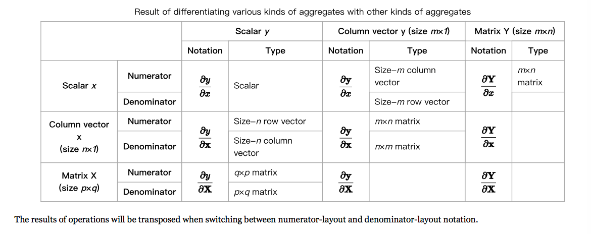
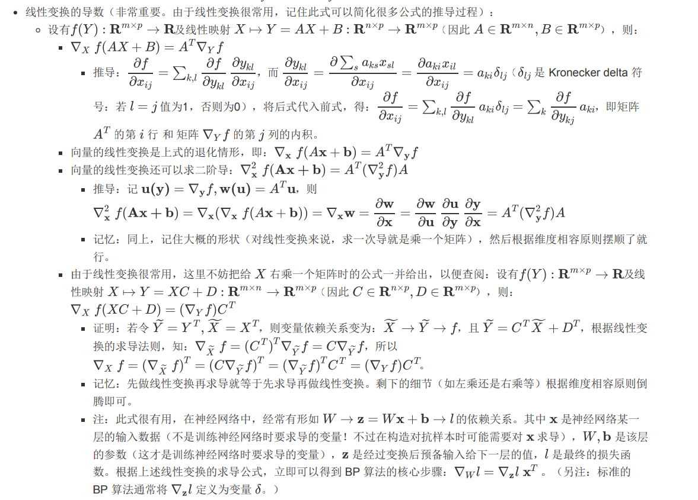

# assignment2 matrix derivation & word2vec & SGD 

> 虽然说要做深度学习很久了，但是这个周末才真正走出一点舒适区，开始敲代码，融会贯通一点点
> 之前对BP有些模糊，还有论文材料里莫名其妙的矩阵维度弄得脑壳疼
> 简单做一些记录啦。每一小节最后给出了reference，应该会比我复述的更清楚~ 有优先级啦。

## 基础知识：矩阵求导

> 高数的基础知识是标量与标量的求导。进入机器学习的世界，论文或代码都是以向量为整体考虑。开始看论文时，会比较迷茫，公式也看不懂。因而首先了解学术界的规范是比较重要的。
> 
> 由于已经有写得很好的文章啦，附在ref里，大家可以直接去看。本文依据作者自己的想法做一个总结。

求导有自变量、因变量，分别可以为标量、向量、矩阵，所以共可能有9种情况。本文我们设定向量都为列向量。

求导就是在考察自变量与因变量的关系，两者由函数关联。矩阵求导实际是多值函数的求导。在思考的时候，可以想一想在网络中自变量与因变量的对应关系。

对于nn中常见情况，考虑标量$y_0$对对向量$v$的求导，其实就是对$v$中每个元素求偏导。（可以理解为网络的最后一层经过dense网络产生一个输出）。

一个向量对一个标量求偏导，也很自然的到一个向量。

$$
\frac{\partial y_0}{\partial v} \\
\frac{\partial \mathbf{y}}{\partial v_0} 
$$

向量对向量的求导是更常见的情况，见于两个隐藏层之间导数的计算，很容易想到得到一个矩阵。但这个矩阵的维度是什么呢？假设对于$y$，$dim(y) = m$，对于$x$，$dim(x) = n$，现求 

$$
\frac{\partial \mathbf{y}}{\partial \mathbf{x}} 
$$

可以想到，不同规定的差异只差一个转置。此时则需要引入分子布局 与 分母布局，对两种情况做定义。

对于分子布局，结果的第一个维度以分子为主；分母布局则以分母为主。我们设定使用分子布局。

$$
 \frac{\partial  \mathbf{y}}{\partial \mathbf{x}} = \left( \begin{array}{ccc} \frac{\partial y_1}{\partial x_1}& \frac{\partial y_1}{\partial x_2}& \ldots & \frac{\partial y_1}{\partial x_n}\\  \frac{\partial y_2}{\partial x_1}& \frac{\partial y_2}{\partial x_2} & \ldots & \frac{\partial y_2}{\partial x_n}\\   \vdots&  \vdots &  \ddots & \vdots \\ \frac{\partial y_m}{\partial x_1}& \frac{\partial y_m}{\partial x_2} & \ldots & \frac{\partial y_m}{\partial x_n}  \end{array} \right)
$$

细心的话可能会发现，确定求导布局后，向量的实际方向（是行向量或是列向量）就不重要了。如分子布局中，分母向量的为行向量还是列向量无关紧要。并在NN中，由于都约定为列向量，所以就不会产生二义性问题。

还应注意的是，在神经网络中，每一层的输入输出一般由列向量表示。默认网络从左向右传播，定义的权重矩阵（$W$）的维度是左边隐层数量（$m$）*右边的隐层数量（$n$），前向传播的公式为 $h_{right} = W^Th_{left}$，权重矩阵会做一个转置。$\frac{\partial \mathbf{h_{right}}}{\partial \mathbf{h_{left}}}$对应于$W_T$.

向量与向量的求导，按分子布局得到的结果矩阵，一般被称为雅克比矩阵。按分母求导得梯度矩阵（和权重矩阵维度相同）。

> 此外，另外三种向量对矩阵的求导，矩阵对向量的求导，以及矩阵对矩阵的求导，在初级阶段不多遇到，遇到再学一学罢。

> ref:
> 1. [刘建平Pinard：机器学习中的矩阵向量求导(一) 求导定义与求导布局](https://www.cnblogs.com/pinard/p/10750718.html)
> 2. [wikipedia: Matrix Caculas(layout conventions)](https://en.wikipedia.org/wiki/Matrix_calculus#Layout_conventions)
> 3. [机器学习中的矩阵求导](https://daiwk.github.io/assets/matrix+vector+derivatives+for+machine+learning.pdf)
> 4. [一个矩阵求导的简述](https://zlearning.netlify.com/math/matrix/matrix-gradient.html)
> > 不过这篇博客应该用的是分母布局

> 有时间可以了解下 泛函分析

## 基础知识：BP

反向传播时如何都避不过的坎，不论似懂非懂的看了、用了多少次。以下内容，包括word2vec，均来自[Xin Rong](https://www.linkedin.com/in/xin-rong-a5b4ba2b/). 

在bp中，我们将一个网络拆分为多层，从后向前的逐层更新梯度矩阵。（每一层，有一个梯度矩阵）。我们考虑最后一层（其实每一层都是同样直观的），首先根据forward pass，我们可以得到每一个隐层的输出，并进一步最终的loss（一个标量）。由loss可以算得，对于最后一个维度每个神经元输出的相对梯度$\frac{\partial loss}{\partial \mathbf{y}}$，根据设定的激活函数，可以推出对应于$h_{right}$的梯度$\frac{\partial loss}{\partial \mathbf{h_right}}$。

$$
h_{right} = W_Th_{h_{left}}\\
y = f(h_{right})
$$

首先要更新这一层的梯度矩阵，我们需要得到$\frac{\partial loss}{\partial \mathbf{W}}$，是一个标量对矩阵的求导。注意，此时不能看做是常规的矩阵求导，按前述内容计算。看下面的这里，讲的比较详细。

核心是可以得到：

$$
\frac{\partial loss}{\partial \mathbf{W}} = \frac{\partial loss}{\partial \mathbf{h_{right}}} \frac{\partial \h_{right}}{\partial W}\\

\Delta_Wl = \Delta_zl{h_{left}}^T
$$

也就是，可以得到对于这一层梯度要如何做调整。那我们要怎么传播回去呢？其实就是要计算$\frac{\partial loss}{\partial \mathbf{h_{left}}}$。然后按照前面的步骤，就可以继续往前推啦。

$$
\frac{\partial loss}{\partial \mathbf{h_{left}}} = \frac{\partial loss}{\partial \mathbf{h_{right}}} \frac{\partial h_{right}}{\partial \mathbf{h_{left}}}\\
而易知\\
\frac{\partial h_{right}}{\partial \mathbf{h_{left}}} = W^T
$$

所以我们就知道每一层的计算，然后就可以愉快的向前传播啦。

> note: 需要用到向量（或矩阵）对矩阵求导的情形，要么把矩阵按列拆开转化成向量对向量求导（最终很有可能通过分块矩阵乘法再合并起来。本文后面的算例 PRML (3.33) 说明了这种方法怎么用），要么套用线性变换的求导公式（常见于神经网络的反向传播过程）。

## 三层的网络：word2vec

> 拥有了论文翻译词典，并看透了NN有效的本质，可以愉快的入门NLP啦。感觉像打通了“任督二脉”？

本文不作为词向量的百科介绍，所以仅简述word2vec的灵感。更多内容可以去看[CS224N](https://www.bilibili.com/video/av46216519?from=search&seid=5235449063749658048)的课程呀。

最简单说，词向量就是用一个向量表示一个词。自然有过很多种方法，为什么word2vec一鸣惊人呢。
1. word2vec可以用于超大数据集。
2. 可以构造出词向量的线性性。

它属于迭代算法，每一次计算中，选取一个center word, 并在其window size范围内取若干个context word。损失函数希望，提升center word 作为输入，context word 作为输出 的（综合）预测准确率（被称为CBOW算法）；或context word作为输入 center word作为输出 的预测准确率（被称为skip-gram算法）。损失函数自然是交叉熵。

只需理解1个context word的情况，其他的也就迎刃而解了。

### "bigram" language model

### CBOW

多个输入，取算数平均，得到隐层输出。此时 input vector，是平均意义上的。

### skip-gram

多个输出，对于一个中心词，希望提高对若干个（假设为m个）context word的综合准确率。（即一般情况只有一个正向输出，现在不止一个）。就是对m个softmax loss取平均作为最终的loss。

> 或者可以理解为，将softmax输出，与一个 m-hot vector计算交叉熵？不很确定，感觉差不多。

### furthre optimization: hierarchical softmax & negative sampling

对于算法的优化，最重要是知道损失函数变成了什么，进而得知反向传播时每一层都要怎么做。

#### hierarchical softmax

hierarchical softmax 是对 softmax的优化，降低了softmax的时间复杂度。将所有词作为叶子节点，建一个哈夫曼树。对于每个输入，需要过一条完整的路径，在每个内部节点上预测向左侧或右侧走。时间复杂度进而变为了O(log(n)).

#### negative sampling

到目前为止，网络还是很难算，因为它每次要更新词汇量级别维度的矩阵。之前的损失函数，我们是希望提高目标词的预测率，降低非目标词的预测率，实际问题在于，非目标词太多了。我们进而只根据某种分布，选择一定量（假设为m个）非目标词（而非全部），损失函数变为(m+1)个逻辑回归损失。进而大幅度减少了计算量。

分布选择有更高的词频的词。

> 可能会想，时间减少了，那准确率一定会变低吧。（实际反而提升了word vector的质量？）
> 上面只是简述 inspiration，有时间会进一步提及。

## CS224N-assignment2

### word2vec

#### naive softmax loss

#### skip-gram loss (sum up naive softmax loss)

#### negative sampling

### SGD

