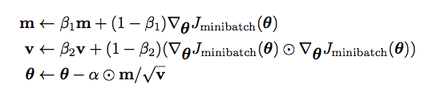

# CS224N-a3 Dependency Parser

## Adam optimizer

对于更新不频繁的参数（典型例子：更新 word embedding 中的低频词），我们希望单次步长更大，多学习一些知识；对于更新频繁的参数，我们则希望步长较小，使得学习到的参数更稳定，不至于被单个样本影响太多。
在一阶动量的基础上，引入二阶动量。



v 是二阶动量，$\beta_2$常设置为0.99，即它估计最近约100次梯度的大小。每一个参数，它的二阶动量若更大，希望它步长偏小；反之则希望增大。

## Dependency Parsing

数据结构：stack buffer 以及一个神经网络预测器model

一个n个单词的句子，会被parse的step数: n次Shift与n次Arc。

> 每个单词都要入栈，每个单词都是且只是一个单词的依赖

dependency arc 的 label 是 具体的依赖关系

### neural network model

1. extract a feature vector representing the current state

> feature set is from this paper: A Fast and Accurate Dependency Parser using Neural Networks.

提取器已经写好了。从当前状态提取出来的是一系列的token，组成一个数组[w1, w2, w3, w4...]，都用index表示。

> 【其实就是从stack， buffer中特定的提取一系列单词？】

2. 将提取的feature中每个token index，转化为 embedding，作为网络输入

$$
h = ReLu(xW + b_1)\\
l = hU + b_2\\
\hat{y} = softmax(l)
$$

> h => hidden layer
> l => logits # 注，logits一般就可以视为将要被softmax的那层输出
> $\hat{y}$ 就是预测的transition.
> 和论文描述有差异，不过不必介意。可以认为是一个简化版的预测器。

## `code`

> 写一个好的文档（注释），表明函数功能，参数（用处、调用方式、大小），返回值，对于没有记忆里的我非常重要。

### `parser_transitions.py`

需要实现的其实很简单，只需要维护数据结构即可，即`stack`, `buffer`。能感觉到和自底向上的编译原理有一点相似。

#### `PartialParse`的初始化：

```python
...
self.stack = ["ROOT"]
self.buffer = sentence.copy()  # sentence is a list of strings
self.dependencies = []
```

#### `parse_step`, 解析出一个dependency：

根据transition，对数据结构进行操作。

> 对LA，RA的记忆。被指向的是dependent(依赖者)。L，R就是stack最后两个元素的依赖方向。

```python
    if transition == "S":
        self.stack.append(self.buffer.pop(0))  # list.pop(i) pop第i项
    elif transition == "LA":
        dependent = self.stack.pop(-2)
        self.dependencies.append((self.stack[-1], dependent))
    elif transition == "RA":
        dependent = self.stack.pop(-1)
        self.dependencies.append((self.stack[-1], dependent))
    else:
        raise Exception('Wrong transition')
```

#### `minibatch_parse`

> 为适应神经网络，一次解析 一个minibatch 中每个sentence各自一步

这里有个“一半深”拷贝问题。众所周知，python是引用传值，直接的赋值不会真正复制元素。若想复制list中内容，则需要：

```python
a = [1,2,3]
b = a
c = a[:]
print(id(a), id(b), id(c))
# 4525186312 4525186312 4525160072
```

但这是对于list中的值是数字的情况。如果list中是特殊的数据结构（大概只要不是数字...?），（list中存的其实是这些数据结构的引用），那么深拷贝只进行了一层，即只深拷贝了这一层引用。

```python
    partial_parses = [PartialParse(sentence) for sentence in sentences]
    # print("partial_parses.shape:", len(partial_parses))
    # print("batch_size:", batch_size)
    unfinished_parses = partial_parses[:]  # 只是一层的浅拷贝，引用还是“深拷贝”
    while len(unfinished_parses):
        pred_transitions = model.predict(unfinished_parses[:batch_size])
        # print("pred_transitions:", pred_transitions)
        for pred_transition, parse in zip(pred_transitions, unfinished_parses[:batch_size]):
            parse.parse_step(pred_transition)
            if not parse.buffer and len(parse.stack) == 1:  # shift 结束，arc也结束
                unfinished_parses.remove(parse)  # remove 解除引用，只删除了引用，没有删除原数据
    dependencies = [partial_parse.dependencies for partial_parse in partial_parses]
```

还要注意关于list切片的一处：

```python
a = [1]
print(a[:1000])  # 不会报错，切片到上限
# [1]
```

### `parser_model` with Pytorch!!!

pytorch使用动态图，定义的模型的核心就是定义 根据输入x，一次`forward(x)`的所做的运算。可以包括额外包括一些辅助函数，如预处理等。训练过程就是声明优化器追踪model的`parameters()`、loss_func，不断调用model的`forward(x)`计算loss得到梯度，使用优化器step()。【进而使用一些或自定义的度量衡量loss（loss_meter）, 比如F1 score等】

#### model 的 定义！

##### `__init__` 初始化：

1. 定义模型超参数
2. 声明每个层， <并为每个层做必要的初始化>

```python
def __init__(self, embeddings, n_features=36,
        hidden_size=200, n_classes=3, dropout_prob=0.5):
    # ...
    super(ParserModel, self).__init__()
    self.n_features = n_features
    self.n_classes = n_classes
    self.dropout_prob = dropout_prob
    self.embed_size = embeddings.shape[1]
    self.hidden_size = hidden_size
    self.pretrained_embeddings = nn.Embedding(embeddings.shape[0], self.embed_size)
    self.pretrained_embeddings.weight = nn.Parameter(torch.tensor(embeddings))
    # layer init 
    self.embed_to_hidden = nn.Linear(self.n_features*self.embed_size, self.hidden_size)
    # see more about xavier_uniform
    # https://andyljones.tumblr.com/post/110998971763/an-explanation-of-xavier-initialization
    # 根据一篇论文的方法去初始化
    nn.init.xavier_uniform_(self.embed_to_hidden.weight)  
    self.dropout = nn.Dropout(self.dropout_prob)
    self.hidden_to_logits = nn.Linear(self.hidden_size, self.n_classes)
    nn.init.xavier_uniform_(self.hidden_to_logits.weight)
```

##### forward

就是拿到一次输入(一个minibatch)后，过一遍每个层得到输出啦。需要注意dropout要在对应层前调用，以mask。

```python
def forward(self, t):
    embeddings = self.embedding_lookup(t)  # 参数预处理
    h = self.embed_to_hidden(embeddings)
    nn.functional.relu(h)
    h_dropout = self.dropout(h)
    logits = self.hidden_to_logits(h_dropout)
    ### END YOUR CODE
    return logits
```


##### 辅助函数：`embedding_lookup`

想要将token index转换为embedding(见前面neural network model部分)
```python
def embedding_lookup(self, t):
    x = self.pretrained_embeddings(t)
    x = x.reshape(x.size()[0], -1) # 拿出来的时候是三维数组(batch_size, sents, embedding)，想把它弄成二维的, 即讲embedding展开
    return x
```

### `run.py`

#### 工具module

1. 参数保存`pickle`, `os`
2. 时间提示`datetime`, `time`
3. 进度条`tqdm`

#### `train_for_epoch` & `train`

写成两个函数会很舒适，可以更好的产生提示信息、保存参数。即在一个epoch内使用进度条，每一个epoch保存一次一次pickle。

```python

```

##### `loss_func`, `optim`

即： model, loss_func, optimizer
```python
from torch import nn, optim
optimizer = optim.Adam(<model>.model.parameters())  # model中所有为nn.<layer>的成员，都以这种方式直接取出
# see more about 
loss_func = nn.CrossEntropyLoss()
```


